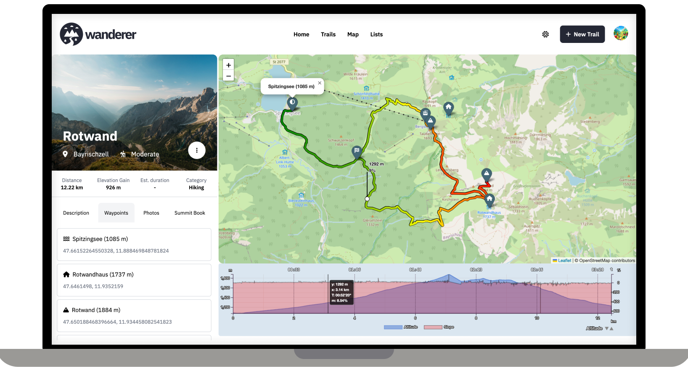

<h4 align="center">
  

  The trail catalogue that makes your GPS data searchable
</h4>

wanderer is a self-hosted trail database. You can upload your recorded tracks and add various metadata to create an easily searchable catalogue. 

## Core Features



- Manage your trails
- Extensive map integration and visualization
- Share trails with other people and explore theirs
- Advanced filter and search functionality
- Create custom lists to organize your trails further


## Getting started
The recommended and quickest way to install wanderer is using docker compose:

``` bash
# clone the git repository
wget https://raw.githubusercontent.com/Flomp/wanderer/main/docker-compose.yml

# build and launch via docker compose
docker compose up -d
```

The first startup can take up to 90 seconds after which you can access the frontend at localhost:3000.

> Note: if you are using wanderer in a production environment make sure to change the MEILI_MASTER_KEY.

You can also run wanderer on bare-metal. Check out the [documentation](https://github.com/Flomp/wanderer/wiki/Installation#from-source) for a detailed how-to guide.

## Documentation

Please check the [wiki](https://github.com/Flomp/wanderer/wiki) for the complete documentation.

## License
This project is licensed under the AGPLv3 License. See the [LICENSE](LICENSE) file for the full license text.
